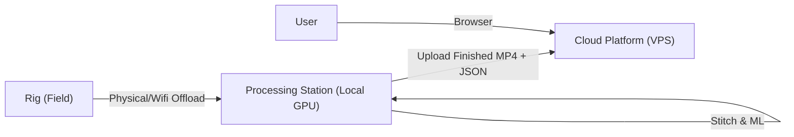

# Architecture Proposal: Soccer Analytics Platform

## Overview

Moving beyond simple recording, the system needs to Handle **Ingest**, **Processing (Stitching/ML)**, and **Delivery (Web/Search)**.

Given the high bandwidth of Raw 4K video (TB of data) and the compute power needed for ML/Stitching, a **3-Tier Architecture** is recommended to balance cost and performance.

## The 3 Tiers

### 1. The Edge (Review: ✅ Complete)

* **Role**: Capture & Sync.
* **Hardware**: 3x Raspberry Pi 5.
* **Output**: 3x Raw 4K Video Files + Manifests (JSON).
* **Location**: The Field.

### 2. The Processor ("Stitching Station")

* **Role**: Heavy Lifting.
* **Hardware**: Local PC / Laptop with NVIDIA GPU.
* **Why Local?**: Uploading 300GB of raw footage to a VPS is slow and expensive. Cloud GPUs are expensive ($2-4/hr).
* **Responsibilities**:
    1. **Ingest**: Copy files from Pis (USB/Network).
    2. **Stitch**: Combine 3 views into one Panoramic Video (ffmpeg/OpenCV + CUDA).
    3. **Analyze (ML)**: Run Object Detection (YOLO/SoccerNet) to identify:
        * Players (Tracking ID)
        * Events (Dribbling, Shots, Goals)
        * Ball Tracking
    4. **Index**: Generate a textual "Event Log" (Timecode + Description).
    5. **Upload**: Send the *Finished* Compressed Video (e.g., 1080p or 4K H.265) + Metadata to Tier 3.

### 3. The Platform (Cloud/VPS)

* **Role**: Delivery & Search.
* **Hardware**: VPS (e.g., DigitalOcean, AWS EC2, Hetzner) + Object Storage (S3).
* **Database**: PostgreSQL (with `pgvector` for hue/semantic search?? OR standard Relational).
* **Responsibilities**:
    1. **Host**: Web Interface for global access.
    2. **Stream**: Serve the processed video to users.
    3. **Search**: "Show me X doing Y". Queries the DB Event Log.
    4. **Download**: Allow tailored clips or full game downloads.

## Data Flow



## Recommended Tech Stack for Server (Tier 3)

* **Backend**: Python FastAPI (matches Rig language).
* **DB**: PostgreSQL.
* **Frontend**: React or Vue (Standard Web App).
* **Storage**: S3-compatible (MinIO or AWS S3) for video files.

## Monorepo Structure

Keep it all here for ease of development.

```text
/
├── soccer_rig/       # (Done) The Pi Code
├── soccer_bench/     # (Proposed) The Processing/Stitching CLI tools (GPU)
├── soccer_platform/  # (Proposed) The FastAPI/Postgres Web Backend
└── ...
```

## Decision Point

Does this **Local Processing -> Cloud Hosting** workflow fit your operations?

* *Alternative*: Upload EVERYTHING to Cloud and pay for GPU instances to process it there. (Easier workflow, much higher cost).
